


🎓 Electronics Engineer &nbsp;·&nbsp; 📊 Data Analyst &amp; BI Specialist &nbsp;·&nbsp; 🔌 Embedded Systems &amp; IoT &nbsp;·&nbsp; ⚙️ Automation Engineering


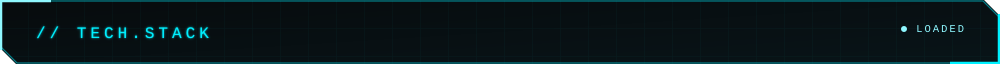

 

### 👨‍💻 Programming & Frameworks

### 📊 Data, BI & Automation
-0a0a12?style=for-the-badge&logo=microsoftexcel&logoColor=00f0ff)

-0a0a12?style=for-the-badge&logo=uipath&logoColor=00f0ff)

### 🔌 Embedded, Simulation & Design


<table>
  <tr>
    <td width="45%" valign="top">
      <a href="https://github.com/AbimaelFranco/Robotic-Arm-3D-Printable">
        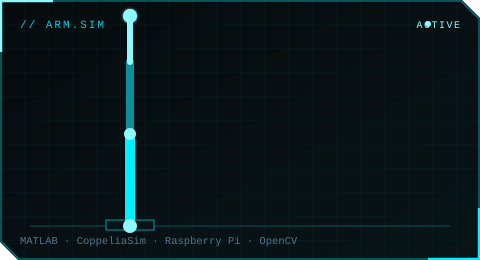
      </a>
    </td>
    <td width="55%" valign="top">
      <b>🦾 6-DOF Robotic Arm — Simulation, 3D Design & Embedded Control</b>  
      Modeled the robot's direct kinematics and built a MATLAB control interface, validated in CoppeliaSim before the physical build. Mechanical parts designed in Fusion 360 and fully 3D-printed. Embedded control runs on a Raspberry Pi configured as its own Wi-Fi access point for remote operation, with multiple control modes — terminal, joystick, keyboard, voice commands, and OpenCV-based color vision for automatic part sorting.  
      <b>Tech:</b> Python · MATLAB · CoppeliaSim · Raspberry Pi · OpenCV · Fusion 360 
      <a href="https://github.com/AbimaelFranco/Robotic-Arm-3D-Printable">→ View repository</a>
    </td>
  </tr>
  <tr>
    <td width="45%" valign="top">
      <a href="https://github.com/AbimaelFranco/HumidityControlSystem">
        
      </a>
    </td>
    <td width="55%" valign="top">
      <b>🌡️ Environmental Control System for a Curing Chamber</b>  
      Designed the monitoring system and control infrastructure for temperature and humidity in a mortar-curing chamber for USAC's Research Center. AHT10 digital sensors over I²C feed a Raspberry Pi 3B acting as processing and server platform, with a custom PCB integrating sensors and actuators (solenoid valves, heating/cooling). A Django + PostgreSQL web dashboard tracks historical readings.  
      <b>Tech:</b> Python · Django · PostgreSQL · Raspberry Pi · PCB Design 
      <a href="https://github.com/AbimaelFranco/HumidityControlSystem">→ View repository</a>
    </td>
  </tr>
  <tr>
    <td width="45%" valign="top">
      <a href="https://github.com/AbimaelFranco/SignTranslator">
        
      </a>
    </td>
    <td width="55%" valign="top">
      <b>🤟 Sign Language Translator (Real-Time)</b>  
      Real-time sign-to-text/speech translation using hand tracking (MediaPipe) and OpenCV. Built a full custom ML pipeline — dataset capture, landmark extraction, classifier training and accuracy evaluation — with per-sign stability validation before logging characters, then auto-generates text and text-to-speech output. Vocabulary is extensible and retrainable without touching the architecture.  
      <b>Tech:</b> Python · OpenCV · MediaPipe · Machine Learning 
      <a href="https://github.com/AbimaelFranco/SignTranslator">→ View repository</a>
    </td>
  </tr>
</table>

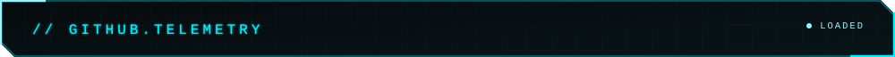



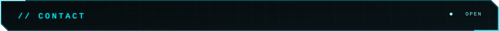

 

> "Striving to build tech that empowers people and improves lives."

